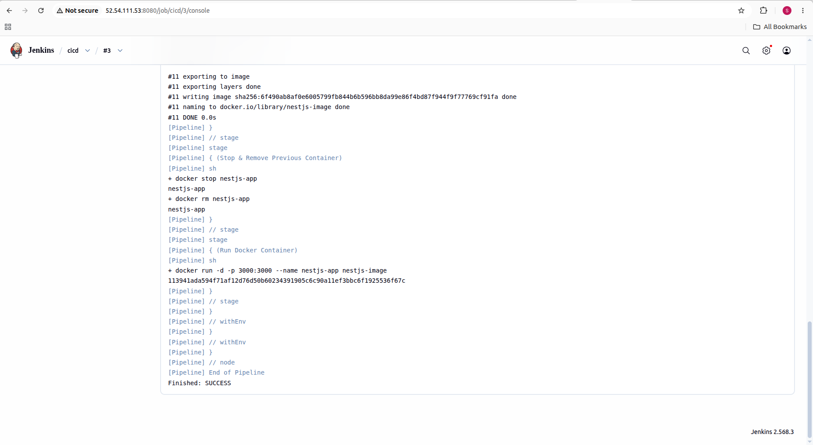
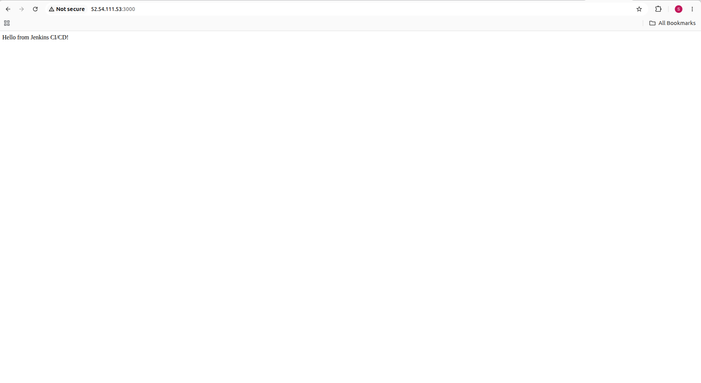

# NestJS CI/CD Deployment using Jenkins, Docker & AWS EC2

## Project Overview

This project demonstrates an automated CI/CD pipeline for a NestJS application using GitHub, Jenkins, Docker, and AWS EC2.

Whenever code is pushed to the `main` branch, GitHub triggers Jenkins automatically. Jenkins builds the Docker image and deploys the updated NestJS application inside a Docker container on an AWS EC2 instance.

## Architecture

```text
Developer
    |
    | git push
    v
GitHub
    |
    | Webhook
    v
Jenkins
    |
    | Docker Build
    v
Docker Image
    |
    | Deploy
    v
AWS EC2
    |
    v
NestJS Application
```

## Technologies Used

* **NestJS** – Backend application framework
* **TypeScript** – Programming language
* **Git & GitHub** – Source code management
* **Jenkins** – CI/CD automation
* **Docker** – Application containerization
* **AWS EC2** – Cloud deployment
* **Linux** – Server environment

## CI/CD Workflow

1. Developer makes changes to the NestJS application.
2. Code is committed and pushed to the GitHub `main` branch.
3. GitHub Webhook automatically triggers Jenkins.
4. Jenkins pulls the latest source code.
5. Jenkins builds the Docker image.
6. Jenkins stops and removes the previous Docker container.
7. Jenkins starts a new container with the updated application.
8. The NestJS application becomes available on port `3000`.

## Jenkins Pipeline

The Jenkins pipeline contains the following stages:

* Clone Repository
* Build Docker Image
* Stop & Remove Previous Container
* Run Docker Container

## Docker

The application is packaged using Docker with a Node.js 22 Alpine base image.

The Docker container exposes port `3000`.

## AWS EC2 Deployment

The application is deployed on an Amazon Linux 2023 EC2 instance.

Application URL:

```text
http://<EC2-PUBLIC-IP>:3000
```

## How to Run Locally

Clone the repository:

```bash
git clone https://github.com/Katukuri-Sai-Prathyusha/nestjs-cicd.git
cd nestjs-cicd
```

Install dependencies:

```bash
npm install
```

Run the application:

```bash
npm run start:dev
```

The application runs on:

```text
http://localhost:3000
```

## Docker Commands

Build the Docker image:

```bash
docker build -t nestjs-image .
```

Run the container:

```bash
docker run -d -p 3000:3000 --name nestjs-app nestjs-image
```

Check running containers:

```bash
docker ps
```

View application logs:

```bash
docker logs nestjs-app
```

## Key Learning Outcomes

* Implemented CI/CD using Jenkins
* Configured GitHub Webhooks for automatic builds
* Containerized a NestJS application using Docker
* Deployed a containerized application on AWS EC2
* Automated application deployment after Git pushes
* Worked with Linux-based cloud infrastructure

## Project Status

**Completed – Automated CI/CD pipeline successfully implemented.**
## Screenshots

### Jenkins CI/CD Pipeline



### Application Running on AWS EC2

